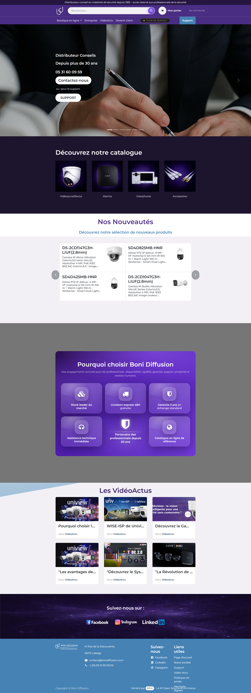

import BrowserWindow from '../../components/mockups/BrowserWindow.astro';
import MobileDevice from '../../components/mockups/MobileDevice.astro';
import ScrollingMockup from '../../components/mockups/ScrollingMockup.astro';

## Le Défi

Boni Diffusion avait un impératif stratégique fort : l'entreprise devait exploiter tout l'environnement ERP **Odoo** pour gérer l'intégralité de sa société (stocks, facturation, clients). Le défi consistait donc à concevoir une plateforme e-commerce B2B unique et ultra-personnalisée, tout en devant composer avec les contraintes techniques et structurelles inhérentes au constructeur de site d'Odoo.

## L'Approche Technique

Plutôt que de se limiter aux templates standards d'Odoo, nous avons poussé le moteur de rendu dans ses retranchements grâce à un développement intensif en **JavaScript** et **CSS personnalisé**. L'objectif était de créer une expérience utilisateur qui masque totalement la lourdeur d'un ERP classique pour offrir une navigation B2B moderne, rapide et sur-mesure.

<BrowserWindow title="boni-diffusion.com">

</BrowserWindow>

## L'Écosystème B2B & Interface

L'interface a été intégralement repensée. En travaillant de concert avec les modules de gestion Odoo, le site offre une recherche optimisée, une présentation des fiches produits enrichie et une expérience d'achat sans friction. La personnalisation avancée du code a permis de contourner les limitations natives d'Odoo pour obtenir le design premium souhaité par la marque.

  <MobileDevice>
    <iframe src="https://www.bonidiffusion.com" title="Boni Diffusion" loading="lazy"></iframe>
  </MobileDevice>

## Résultat

- **E-commerce unifié** : Un front-end magnifique entièrement connecté à la puissance de gestion d'Odoo.
- **Design Unique** : Un rendu visuel qui se démarque totalement des standards rigides du CMS de base.
- **Gestion simplifiée** : L'équipe Boni Diffusion gère toute l'entreprise (site web, factures, stocks) depuis une seule interface.

<ScrollingMockup height="600px">

</ScrollingMockup>
