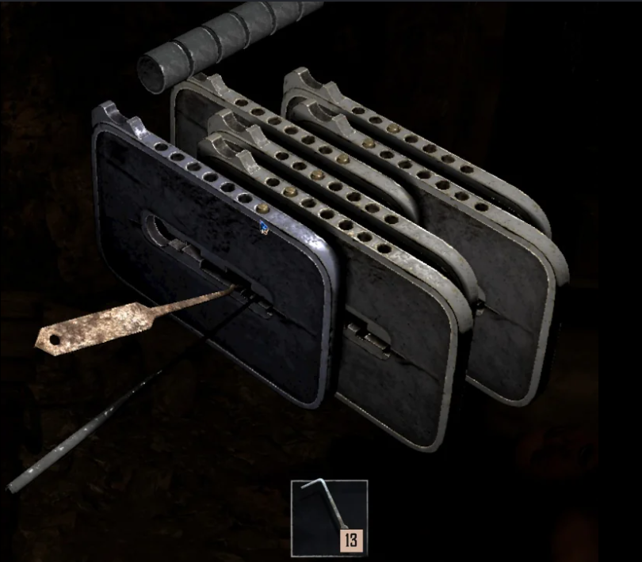
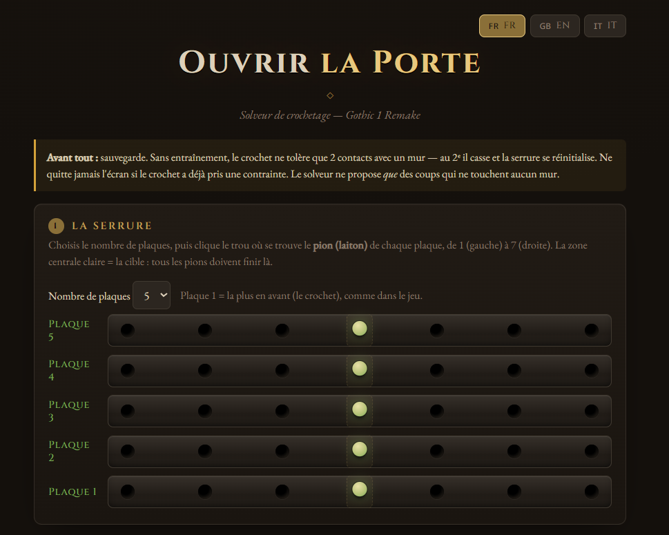
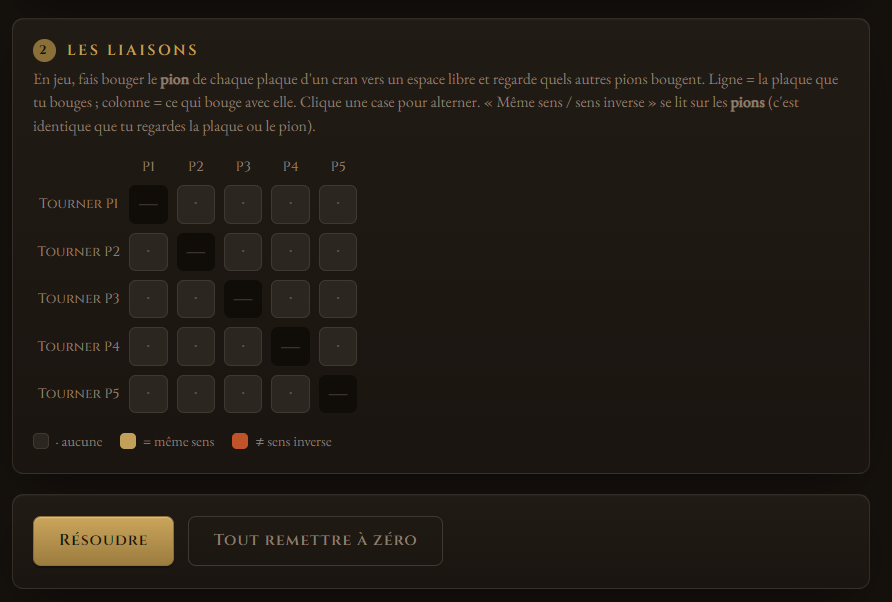

# Lisez-moi : G1-Lockpick_Solver.exe

> [!NOTE]
> Bienvenue dans le terminal de décryptage des serrures pour l'univers de Gothic 1 Remake. 

## À propos de cet outil

**Gothic 1 Remake - Lockpick Solver** est un utilitaire tactique conçu pour les pilleurs de tombes et les explorateurs de la Colonie Pénitentiaire. Le système de crochetage dans le remake demande de la précision et une bonne mémoire pour trouver la séquence exacte (Gauche/Droite). Cet outil a été développé pour automatiser et mémoriser cette séquence sans risquer de briser tous vos précieux crochets.

## Fonctionnalités

- **Tracking de séquence :** Mémorise vos entrées et déduit les mouvements restants.
- **Minimisation des casses :** L'algorithme calcule le chemin optimal pour préserver vos crochets.
- **Interface Rapide :** Pensé pour être utilisé en surimpression (ou sur un second écran/téléphone) pendant que vous jouez.

## Aperçu de l'interface

## Mode d'emploi

1. Face à un coffre verrouillé, cliquez sur le bouton de lancement ci-dessous pour ouvrir le *Solver* dans un nouvel onglet.
2. Tentez un mouvement (Gauche ou Droite) dans le jeu.
3. Si le mouvement est valide, entrez-le dans le *Solver*. S'il échoue, l'outil met à jour son arbre de probabilités.
4. Laissez l'outil vous guider jusqu'à l'ouverture du coffre !

  
Lancer l'application externe :

  <a href="https://okamilang.github.io/gothic1-lockpick-solver/" target="_blank" style="display: inline-block; padding: 10px 20px; background: var(--cyber-cyan); color: black; font-weight: bold; text-decoration: none; border-radius: 4px; font-family: var(--font-mono);">> EXECUTER SOLVER_WEB</a>

