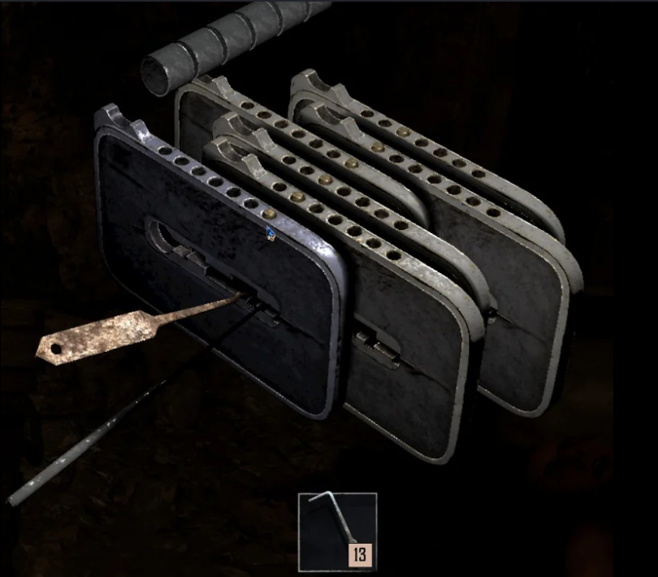
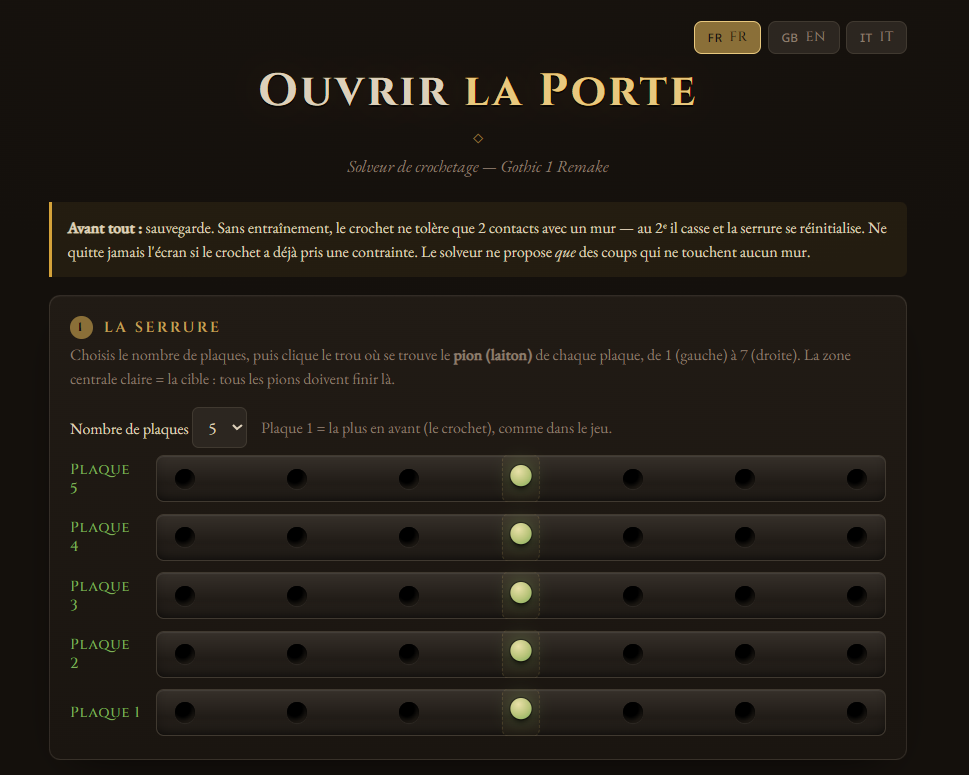
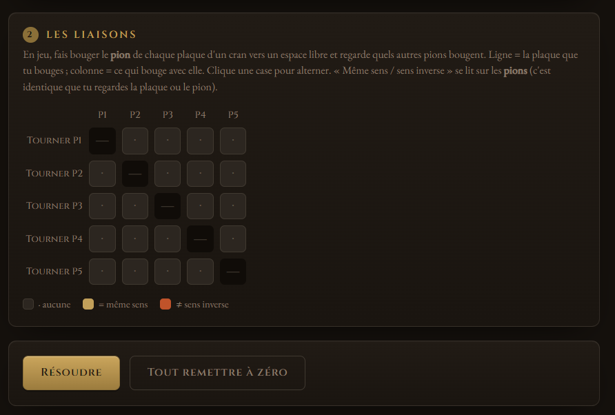

# Lisez-moi : G1-Lockpick_Solver.exe

> [!NOTE]
> Bienvenue dans le terminal de décryptage des serrures pour l'univers de Gothic 1 Remake. 

## À propos de cet outil

**Gothic 1 Remake - Lockpick Solver** est un utilitaire tactique conçu pour les pilleurs de tombes et les explorateurs de la Colonie Pénitentiaire. Le système de crochetage dans le remake demande de la précision et une bonne mémoire pour trouver la séquence exacte (Gauche/Droite). Cet outil a été développé pour automatiser et mémoriser cette séquence sans risquer de briser tous vos précieux crochets.

## Fonctionnalités

- **Tracking de séquence :** Mémorise vos entrées et déduit les mouvements restants.
- **Minimisation des casses :** L'algorithme calcule le chemin optimal pour préserver vos crochets.
- **Interface Rapide :** Pensé pour être utilisé en surimpression (ou sur un second écran/téléphone) pendant que vous jouez.

## Aperçu de l'interface

## Mode d'emploi

1. **Saisis la serrure**
   Choisis le nombre de plaques. Puis, pour chaque plaque, clique le trou où se trouve son pion (laiton), de 1 (gauche) à 7 (droite). Le centre (trou 4) est la cible : tous les pions doivent finir là.
2. **Renseigne les liaisons**
   En jeu, pousse le pion de chaque plaque d'un cran vers un espace libre et regarde quels autres pions bougent. Reporte-le dans la grille : · aucune, = même sens, ≠ sens inverse. (Une case = « quand je bouge la plaque de la ligne, la plaque de la colonne réagit comme ceci ».)
3. **Lance la résolution**
   Clique Résoudre. L'outil calcule la séquence de coups la plus courte qui n'écrase jamais un pion contre un mur.
4. **Reproduis coup par coup**
   Avance avec Suivant et refais chaque mouvement en jeu. Choisis le mode qui te parle — Plaque (la touche à presser) ou Pion (ce que tu vois bouger) — le plateau animé confirme à chaque fois. Si un coup demandé est impossible en jeu (pion déjà au mur), c'est qu'une position ou une liaison saisie est fausse : corrige-la et relance.

  
Lancer l'application externe :

  <a href="https://okamilang.github.io/gothic1-lockpick-solver/" target="_blank" style="display: inline-block; padding: 10px 20px; background: var(--cyber-cyan); color: black; font-weight: bold; text-decoration: none; border-radius: 4px; font-family: var(--font-mono);">> EXECUTER SOLVER_WEB</a>

