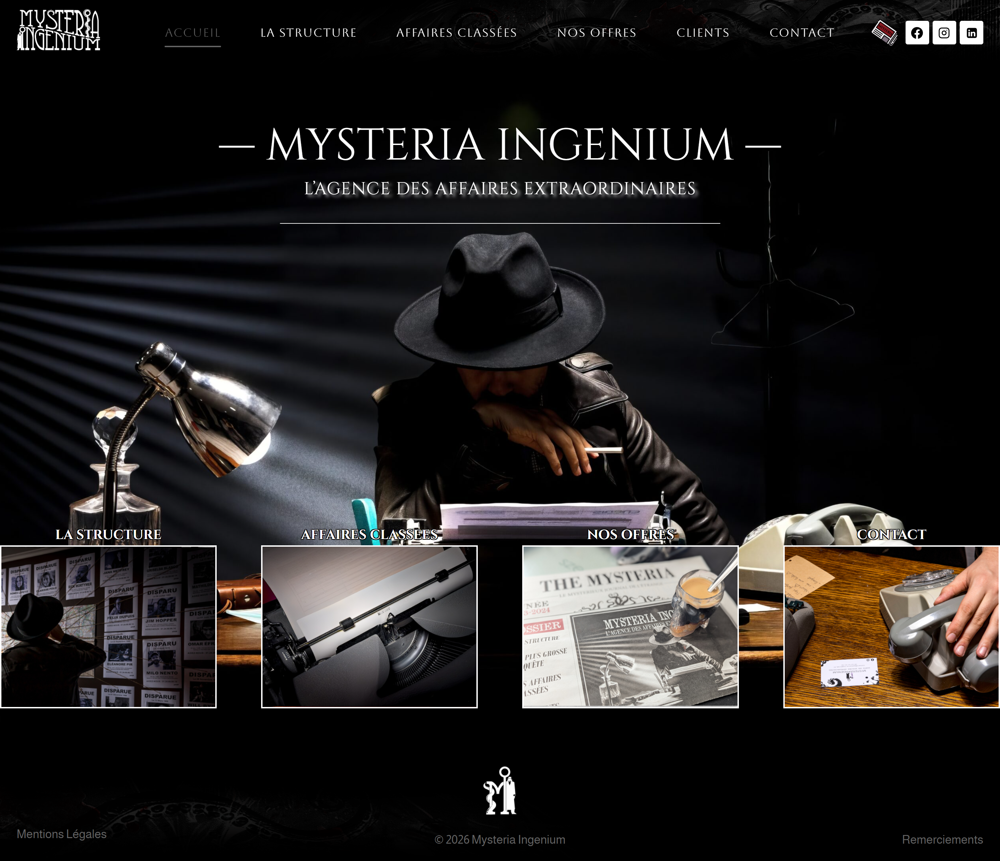

import BrowserWindow from '../../components/mockups/BrowserWindow.astro';
import MobileDevice from '../../components/mockups/MobileDevice.astro';

## Le Défi : Allier Sur-Mesure et Autonomie

Mysteria Ingenium nécessitait une vitrine digitale immersive, à la fois très esthétique et interactive. Cependant, l'une des contraintes majeures était de laisser à l'utilisateur final une totale autonomie pour éditer et travailler sur son contenu. La solution ? Utiliser **WordPress** comme socle de gestion de contenu, mais en sortant totalement des sentiers battus de ses templates restrictifs.

<BrowserWindow title="mysteria-ingenium.com">

</BrowserWindow>

## Exécution Technique

Pour accomplir ce tour de force, un développement massif en **JavaScript** et **CSS personnalisé** a été greffé sur le cœur WordPress. Nous avons créé des blocs et des logiques d'affichage uniques qui permettent de garantir une identité visuelle saisissante (animations, atmosphère oppressante, interactivité) tout en permettant au client final de modifier ses textes et ses images directement depuis son tableau de bord WordPress. Une fusion parfaite entre une interface "Hard-coded" et un CMS dynamique.

  <MobileDevice>
    <iframe src="https://mysteria-ingenium.fr" title="Mysteria Ingenium" loading="lazy"></iframe>
  </MobileDevice>

